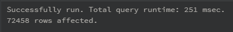
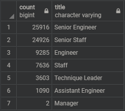
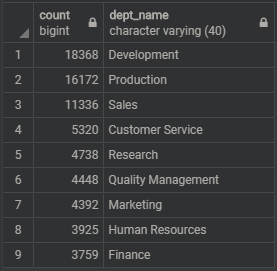

# Pewlett-Hackard-Analysis

## Overview
Pewlett Hackard is a large company that has several thousand employees. They would like to prepare to fill potential vacancies in their company as baby boomers begin to retire at a rapid rate. Pewlett Hackard is offering a retirement package for those who meet certain criteria and is also introducing a mentoring program where experienced and successful employees are mentors to newly hired employees. The purpose of this analysis is to determine the number of retiring employees per title and identify employees who are eligible to participate in the mentorship program.

## Results
#### Criteria of Analyses
- Number of Retiring Employees by Title
  - Employees with a birthdate between 1952 and 1955.
- Employees Eligible for the Mentorship Program
  - Employees with a birthdate in 1965.
 

- There were 133,776 rows in the “retirement_titles” table and 90,398 rows in the “unique_titles” table after running the distinct on function. The number decreased because we removed duplicate rows where a single employee may have had switched positions in the company.

- The results show 90,398 employees born between 1952 and 1955 that are soon to retire. However, this number includes employees that may not still be employed by the company.

- According to the “retiring_titles” query table, there will be retirees in all positions. Senior Engineers have the highest count (29,414) and Managers have the lowest count (2). Senior Staff, Engineer, Staff, Technique Leader, and Assistant Engineer have a count of “28,254”, “14,222”, “12243”, “4,502”, and “1,761”, respectively. Again, these counts may include employees that are no longer employed by Pewlett Hackard and should be reviewed.

- 1,549 employees are eligible for the mentorship program. This number excludes any employee that is no longer with the company.

## Summary
1. How many roles will need to be filled as the "silver tsunami" begins to make an impact?
#### Criteria of Analysis
- Employees with birthdates between 1952 and 1955.
-	Employees currently employed.

There are 72,458 employees within our criteria currently employed that are soon to retire. So, 72,458 number of roles will need to be filled as the “silver tsunami” begins to make an impact. Refer to the Revised Retiring Titles Table below for a breakdown of employees by title and Revised Retiring Departments Table for a breakdown of employees by departments.

**Revised Retiring Titles Table**                             **Revised Retiring Departments Table**  
    

2. Are there enough qualified, retirement-ready employees in the departments to mentor the next generation of Pewlett Hackard employees?
